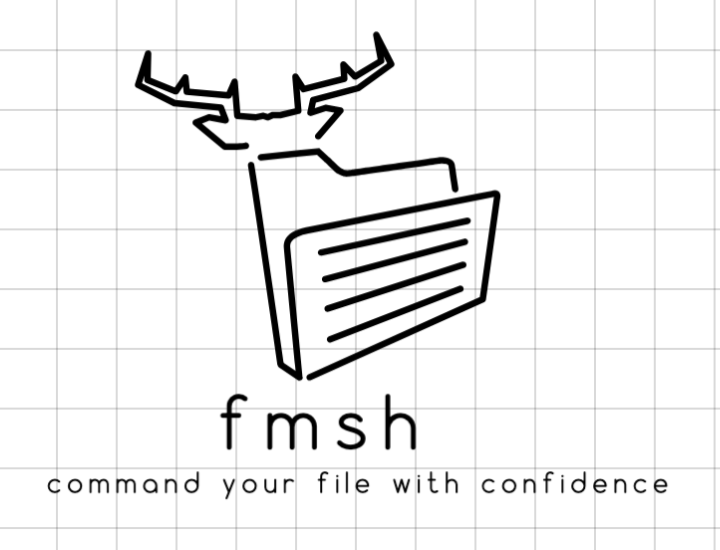

# **fmsh - File Management Shell**



`fmsh` is a lightweight and high-performance file management shell designed to streamline file system operations and analytics. The shell provides a user-friendly interface to manage files, perform advanced analytics, and execute tasks efficiently, leveraging the power of Go’s **goroutines** for enhanced performance.

---

## **Key Features**

### **Performance Optimization with Goroutines**

- Use gorotine to optmise the linux commands like `cp`, `find` and others.
- e.g the analytics command (`inspect`) leverages **goroutines** to analyze files and directories in parallel, significantly reducing processing time for large directories. Looking forwards to leverage it in other commands
- Undo functionality for rm like commands

---

## **Getting Started**

### **Installation**

1. Clone the repository:
   ```bash
   git clone https://github.com/Agent-Hellboy/fmsh.git
   cd fmsh
   ```

2. Build the project:
   ```bash
   go build -o fmsh ./cmd
   ```

3. Run the shell:
   ```bash
   ./fmsh
   ```

---

#### 
 - Currently, you can install the binary for Mac using homebrew 
 

## **Usage**

### **1. Start the Shell**
Launch the shell:
```bash
fmsh>
```

### **2. Run Commands**
Example commands:
- **Analytics**:
  ```bash
  fmsh> inspect
  ```
  Output:
  ```
  File System Analytics for: /example-dir
  -----------------------------------------
  Number of files: 10
  Number of directories: 3
  Total size of files: 20480 bytes
  Largest file: /example-dir/file4.png (4096 bytes)
  Most recently modified file: /example-dir/file2.go (Modified at: Thu, 20 Nov 2024 14:23:45 UTC)
  -----------------------------------------
  ```

---

## **Commands**

| Command            | Description                                      |
|--------------------|--------------------------------------------------|
| `inspect`          | Perform analytics on the current directory.      |
| `search`           | Search files with wildcard patterns.             |
| `disk-usage`       | Summarize the disk usage of the current directory.|
| `tree`             | Display the directory structure in a tree format.|
| `clean-tmp`        | Identify and optionally delete temporary files.  |
| `zip`              | Create a zip archive of specified files.         |
| `unzip`            | Extract a zip archive.                           |
| `rename`           | Rename a file or directory.                      |
| `chmod`            | Modify file permissions.                         |
| `open`             | Open a file with the system's default application.|
| `preview`          | Display the first few lines of a file.           |

Several others

---

## **Why fmsh?**

- **Performance**: Uses Go’s **goroutines** for high-performance analytics.
- **Flexibility**: Offers a variety of commands for common file management tasks.
- **Simplicity**: Intuitive command structure for easy interaction.

---

## **Contributing**

We welcome contributions to improve `fmsh`! Feel free to submit pull requests or open issues on GitHub.

---

## **License**

This project is licensed under the **GPL-3.0 License**.

---

## **Future Enhancements**

A lot can be done.  

---
