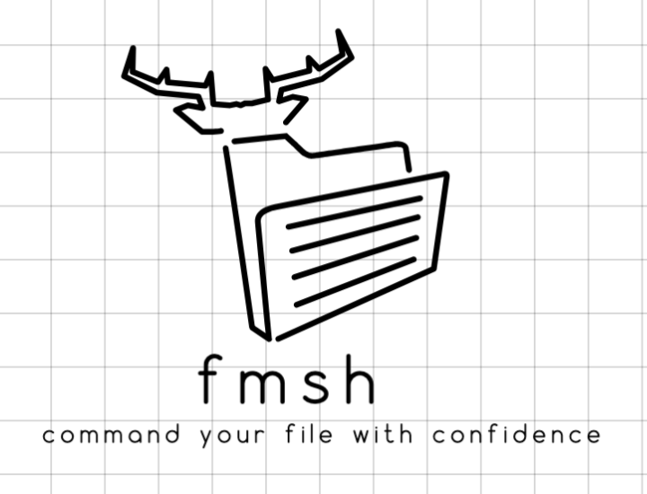

<p align="center">
  
</p>

<h1 align="center">fmsh — Forensic Machine Shell</h1>

<p align="center"><b>A black box recorder for AI-driven development on macOS.</b></p>

---

fmsh runs a local daemon that continuously records filesystem, process, port, Git,
and risk events so you can audit what AI agents, CLIs, scripts, and automation
changed on your machine.

The world is moving toward autonomous AI coding agents — Cursor, Claude Code,
Codex, Copilot-style tools, and agentic CLIs that run commands, edit files,
install dependencies, and start servers on your behalf. fmsh is the local audit
layer you want before you trust them.

It runs locally, records activity events, groups them into sessions, detects
risky changes, and gives you an audit trail for agentic coding workflows.

```
fmshd is always watching.
Every important local activity becomes an event.
The CLI lets you ask what happened.
```

fmsh answers questions like:

- What did Cursor, Claude Code, or Codex change?
- What files were created, modified, deleted, or renamed?
- What commands/processes appeared during an agent session?
- Did anything touch `.env`, SSH keys, kubeconfig, or cloud credentials?
- Did a dependency or lockfile change?
- Did a local server or suspicious port open?
- What changed between the start and end of a session?
- What should I review before committing?

## Principles

```
daemon-first · event-log-first · audit-first · macOS-only · local-first
```

No cloud. No telemetry. No AI in the core. All data stays in `~/.fmsh`.
There are **no manual state-snapshot commands** — the daemon records continuously
and the CLI queries the log.

> **macOS only.** fmsh is built for macOS and depends on macOS facilities:
> APFS local snapshots (`tmutil`) for undo, and `ps` / `lsof` / `git` for
> collectors. It requires macOS 10.15+ on an APFS volume. Recording needs no
> sudo; only restoring a file from a snapshot needs a one-time elevation.

## Install

```bash
go install github.com/Agent-Hellboy/fmsh/cmd/fmsh@latest
```

or build from source:

```bash
git clone https://github.com/Agent-Hellboy/fmsh
cd fmsh
go build -o fmsh ./cmd/fmsh
```

fmsh uses a pure-Go SQLite driver, so it builds with `CGO_ENABLED=0`.

## Quick start

```bash
fmsh init                       # create ~/.fmsh, config, and database
fmsh watch add ~/code/my-app    # watch a project
fmsh daemon start               # start the recorder

# ... let an AI agent or your own work run ...

fmsh timeline --since 30m       # chronological events
fmsh what-changed --since 30m   # human-readable summary
fmsh agent-report --since 2h    # AI/dev-session audit report
fmsh risks --since 24h          # risk summary
```

> **macOS permissions:** for file events to be captured, grant your terminal
> **Full Disk Access** in *System Settings → Privacy & Security*. Run
> `fmsh doctor` if something looks off.

## Commands

### Setup & daemon

| Command | Description |
| --- | --- |
| `fmsh init` | Create `~/.fmsh`, default config, and the database |
| `fmsh daemon start [--foreground] [--watch PATH]` | Start the recording daemon |
| `fmsh daemon stop` | Stop the daemon |
| `fmsh daemon restart` | Restart the daemon |
| `fmsh daemon status` | Show running state, pid, heartbeat, event counts |
| `fmsh doctor` | Diagnose config, database, daemon, and permissions |

### Watched paths

```bash
fmsh watch add ~/code/my-project
fmsh watch remove ~/code/my-project
fmsh watch list
```

### Timeline & events

```bash
fmsh timeline --since 1h
fmsh timeline --from "5pm" --to "6pm"

fmsh events --since 1h --type file.write
fmsh events --since 1h --category process
fmsh events --since 1h --path package.json
```

### Human-readable summaries

```bash
fmsh what-changed --since 30m
fmsh agent-report --since 2h
```

### Sessions

```bash
fmsh sessions
fmsh session show <session_id>
fmsh session diff <session_id>
fmsh session risks <session_id>
```

### Risk & blame

```bash
fmsh risks --since 24h
fmsh blame --path package.json
fmsh blame --path .env
```

### Undo — snapshot restore points

fmsh can create **APFS local snapshots** as restore points so you can revert
mistakes an agent (or you) made. Snapshots are instant, copy-on-write, and kept
by macOS — fmsh stores only a reference, never your file contents.

Restore points are created automatically by the daemon (at session start and
before high-severity risks), and — most precisely — by an opt-in shell hook that
snapshots *before* a destructive command runs:

```bash
# add the pre-command guard to your shell (once)
echo 'eval "$(fmsh shell-init)"' >> ~/.zshrc

# now, before `rm -rf`, `chmod -R`, `curl | sh`, `sudo`, … fmsh snapshots first
fmsh checkpoints                              # list restore points
fmsh restore <id> --path ~/code/app/src      # recover a file or directory
fmsh restore <id> --path ~/code/app/x --print  # just show the commands
```

Creating snapshots needs no sudo. Restoring mounts the snapshot read-only, which
requires a one-time `sudo` (restore is a rare, deliberate action); use `--print`
to run the steps yourself.

Every command supports `--json` for machine-readable output and `--no-color`.

Time flags accept durations (`30m`, `1h`, `24h`) for `--since`, and clock/day
expressions (`5pm`, `17:00`, `yesterday 6pm`) for `--from` / `--to`.

## Architecture

```
fmsh CLI  ──reads──►  SQLite event store  ◄──writes──  fmshd daemon
                                                          ├─ file collector    (fsnotify)
                                                          ├─ process collector (ps)
                                                          ├─ port collector    (lsof)
                                                          ├─ git collector     (git porcelain)
                                                          ├─ risk detector
                                                          └─ sessionizer
```

Collectors run as independent loops and emit normalized events. A failure in one
collector never crashes the daemon. The store (`~/.fmsh/activity.db`, SQLite in
WAL mode) is the single source of truth the CLI queries.

### Event model

Normalized event types include:

```
process.start / process.exit
file.create / file.write / file.delete / file.rename / file.chmod
port.open / port.close
git.file_added / git.file_modified / git.file_deleted / git.diff_summary
risk.secret_touched / risk.dependency_changed / risk.launch_agent_changed
risk.large_file_created / risk.many_files_changed / risk.destructive_command
risk.new_executable_downloads
agent.session_started / agent.session_ended
checkpoint.created / checkpoint.restored
```

> **Process tracking** in v1 focuses on recognized AI/dev tools (Claude Code,
> Cursor, Codex, node, npm, python, go, cargo, docker, git, shells, …) so the
> timeline stays free of macOS system noise.

### Risk detection

| Risk | Severity | Trigger |
| --- | --- | --- |
| `secret_touched` | high | `.env`, SSH keys, `.aws/credentials`, `.kube/config`, … |
| `dependency_changed` | medium | `package.json`, `go.mod`, `Cargo.lock`, lockfiles, … |
| `launch_agent_changed` | high | files under `LaunchAgents` / `LaunchDaemons` |
| `large_file_created` | medium | file larger than `large_file_mb` (default 100 MB) |
| `many_files_changed` | medium | more than `many_files_threshold` files in the window |
| `destructive_command` | high | `rm -rf`, `chmod -R`, `curl \| sh`, `sudo`, … |
| `new_executable_downloads` | medium | `.dmg`, `.pkg`, `.sh`, … appearing in `~/Downloads` |

## Configuration

`~/.fmsh/config.yaml` (created by `fmsh init`) controls watch paths, ignore
directories, poll intervals, risk thresholds, session timeout, and privacy:

```yaml
db_path: ~/.fmsh/activity.db
daemon:
  process_poll_interval: 2s
  port_poll_interval: 10s
  git_poll_interval: 15s
  heartbeat_interval: 10s
watch_paths: [~/code, ~/Developer, ~/Downloads, ~/Desktop]
risk:
  large_file_mb: 100
  many_files_threshold: 50
  many_files_window: 5m
session:
  inactivity_timeout: 10m
privacy:
  store_cmdline: true
  redact_secrets: true      # redact token=/api_key=/password= values in cmdlines
  store_file_hashes: false
guard:
  enabled: true             # daemon auto-creates APFS snapshot restore points
  snapshot_on_session: true # snapshot at session start
  snapshot_on_high_risk: true
  min_interval: 2m          # cooldown between daemon-driven snapshots
```

## Privacy

fmsh audits sensitive activity, so it is careful by default: it stores command
lines but **redacts obvious secret values**, does **not** store file contents,
and never collects browser history, keystrokes, or the clipboard. Nothing leaves
your machine.

## Roadmap

Not in v1, but the architecture is designed to grow into: EndpointSecurity /
OpenBSM collectors, Santa & osquery integration, launchd service installation, a
TUI dashboard, and AI-generated natural-language explanations of sessions.

## License

GPL-3.0 — see [LICENSE](LICENSE).
