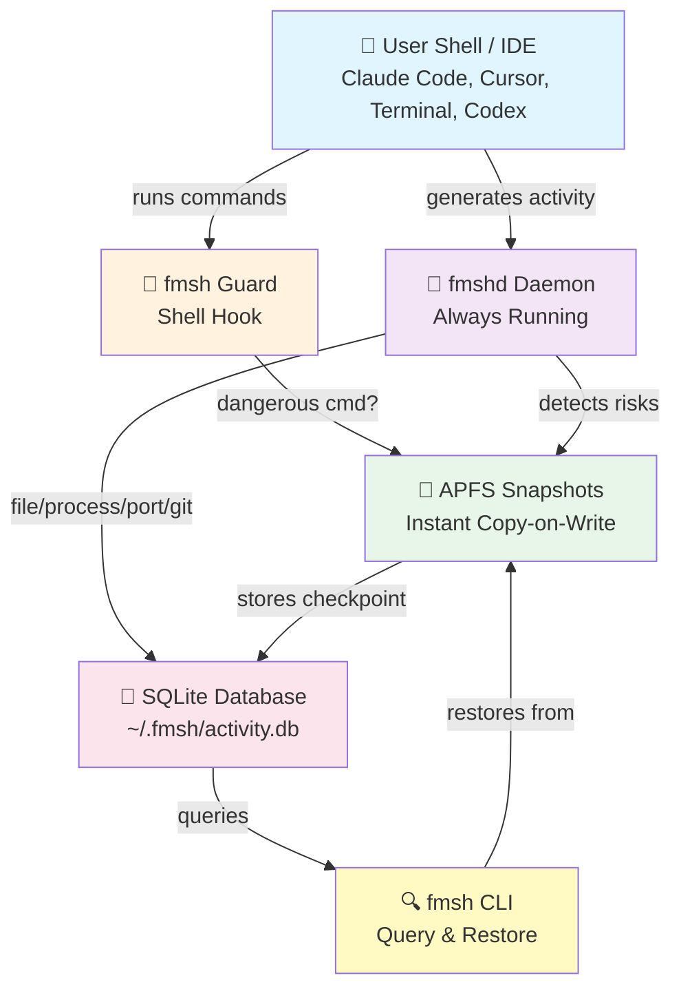
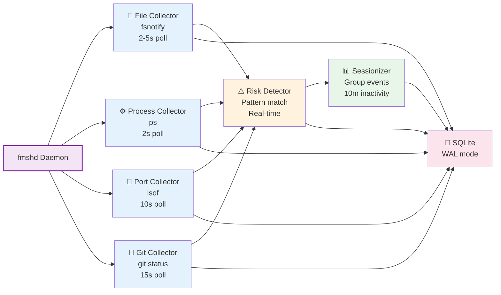
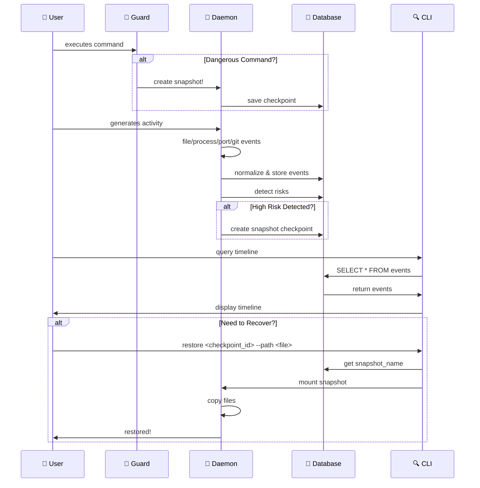

# fmsh Architecture

A technical deep-dive into how Forensic Machine Shell records, detects, and recovers from agent-driven changes.

## System Overview



## Core Components

### Daemon Collectors Architecture



### 1. **fmshd Daemon** (`internal/daemon/`)

The always-running background service that collects and records activity.

**Collectors (independent loops):**
- **File Collector** (`pkg/collectors/file.go`)
  - Uses `fsnotify` to watch configured paths
  - Detects: create, write, delete, rename, chmod
  - Stores file metadata (path, mode, size, mtime)
  - ~2-5 second poll interval (configurable)

- **Process Collector** (`pkg/collectors/process.go`)
  - Polls `ps` every 2 seconds (configurable)
  - Tracks recognized dev tools: Claude Code, Cursor, Node, npm, Python, Go, Cargo, Docker, Git, shells
  - Ignores system noise (Finder, Spotlight, etc.)
  - Records: process name, PID, command line, parent process

- **Port Collector** (`pkg/collectors/port.go`)
  - Polls `lsof` every 10 seconds (configurable)
  - Detects new listening ports
  - Useful for: local servers, suspicious port binds, tunnel detection

- **Git Collector** (`pkg/collectors/git.go`)
  - Polls `git` status every 15 seconds per watched repo
  - Detects: staged files, unstaged changes, untracked files, branch changes
  - Normalizes: `git.file_added`, `git.file_modified`, `git.file_deleted`, `git.diff_summary`

- **Risk Detector** (`pkg/detectors/risk.go`)
  - Watches for sensitive patterns in real-time
  - Detects:
    - Secret files touched (`.env`, `.aws/credentials`, `.kube/config`, SSH keys)
    - Dependency changes (`package.json`, `go.mod`, `Cargo.lock`, lockfiles)
    - Launch agents changed (`~/Library/LaunchAgents`, `~/Library/LaunchDaemons`)
    - Large files created (>100 MB default)
    - Many files changed in a window (>50 files in 5 min default)
    - Destructive commands (from guard events)
    - Executable downloads (`.dmg`, `.pkg`, `.sh` in `~/Downloads`)

- **Sessionizer** (`pkg/sessionizer/`)
  - Groups events into sessions (logical workflows)
  - Session boundaries: inactivity timeout (default 10 min)
  - Detects session agent: which tool triggered the session (Claude Code, Cursor, manual, etc.)

### 2. **Guard System** (shell hook)

Pre-command snapshot mechanism. Intercepts dangerous operations *before* they execute.

**How it works:**
1. Shell hook (`shell-init`) adds `preexec` trap to zsh/bash
2. Before each command executes, hook calls `fmsh guard --cwd <pwd> -- <command>`
3. Guard detector pattern-matches against dangerous regex:
   - `rm -rf`, `rm -r`, `rm *.`
   - `chmod -R`
   - `curl | sh`, `wget -O - | sh`
   - `sudo` (any sudo command)
   - `dd if=/dev/zero`, `mkfs`, `fdisk`
4. **If match**: create APFS snapshot immediately, emit `risk.destructive_command` event
5. Command continues normally (guard doesn't block, just snapshots)
6. User has restore point *before* the operation

### 3. **APFS Snapshot Management**

macOS-native copy-on-write snapshots for instant, space-efficient backups.

**Why APFS snapshots:**
- **Instant**: no copy overhead
- **Space-efficient**: only stores changed blocks (copy-on-write)
- **Atomic**: snapshot is consistent at a point in time
- **Managed by macOS**: no fmsh data corruption risk
- **Recoverable**: fmsh stores only the snapshot name/reference

**Snapshot lifecycle:**
1. Daemon triggers snapshot (session start, high-risk event, guard)
2. Call `tmutil snapshot / -n "com.apple.TimeMachine.2026-07-09-140400.local"`
3. Store snapshot name in database as checkpoint
4. On restore: `mount_apfs -s <snapshot_name> /dev/diskXsY /mnt` (read-only)
5. Copy files from mount to original location
6. Unmount snapshot

### 4. **Event Store** (SQLite)

Single source of truth for all recorded activity.

**Schema highlights:**
- `events` table: normalized event stream (timestamp, type, category, source, PID, path, metadata)
- `sessions` table: logical groupings (start, end, agent, repo, risk count)
- `checkpoints` table: snapshot metadata (ID, snapshot name, trigger, command, root path)
- `processes` table: seen process names and PIDs
- `risks` table: detected risky events (severity, type, context)

**WAL mode**: Write-Ahead Logging for safe concurrent reads (CLI queries while daemon writes).

## Event Model

### Event Flow Diagram



### Event Types

Normalized events emitted by collectors:

```
PROCESS_START/PROCESS_EXIT
  • timestamp, pid, process_name, cmdline, parent_pid

FILE_CREATE/FILE_WRITE/FILE_DELETE/FILE_RENAME/FILE_CHMOD
  • timestamp, path, mode, size (for create), old_name (for rename)

PORT_OPEN/PORT_CLOSE
  • timestamp, port, protocol, pid, process_name

GIT_FILE_ADDED/GIT_FILE_MODIFIED/GIT_FILE_DELETED/GIT_DIFF_SUMMARY
  • timestamp, path, repo, diff lines added/removed

RISK_*
  • risk.secret_touched
  • risk.dependency_changed
  • risk.launch_agent_changed
  • risk.large_file_created
  • risk.many_files_changed
  • risk.destructive_command
  • risk.new_executable_downloads

SESSION_STARTED/SESSION_ENDED
  • session_id, start_time, end_time, agent, repo, event_count, risk_count

CHECKPOINT_CREATED/CHECKPOINT_RESTORED
  • checkpoint_id, snapshot_name, trigger (session_start, destructive_command, high_risk)
```

## Privacy & Redaction

**Data stored:**
- ✅ File paths, timestamps, process names
- ✅ Command lines (with redaction)
- ✅ Process IDs, Git metadata
- ❌ File contents (never stored)
- ❌ Browser history
- ❌ Clipboard data
- ❌ Keystroke logs

**Redaction (`privacy.redact_secrets: true`):**
- Command lines scanned for patterns: `token=`, `api_key=`, `password=`, `AWS_SECRET_`, `GITHUB_TOKEN=`
- Matched values replaced with `***redacted***`
- Example: `curl -H "Authorization: Bearer sk-1234"` → `curl -H "Authorization: Bearer ***redacted***"`

## Failure Modes & Resilience

**Collector failures:**
- Each collector runs independently in its own goroutine
- If one collector panics: logged, recovered, others continue
- Daemon heartbeat: every 10s, stored in database
- If daemon dies: CLI can still query the database (read-only)

**Database failures:**
- SQLite WAL mode prevents corruption during concurrent access
- If database is locked: collectors retry with exponential backoff
- If disk full: snapshot creation fails gracefully, risk event recorded

**Snapshot failures:**
- If APFS snapshot fails: risk event logged, restore point unavailable but daemon continues
- If snapshot is corrupted: `mount_apfs` fails, user gets clear error
- If restore is interrupted: snapshot mount remains (user must manually `umount`)

## Configuration

See `~/.fmsh/config.yaml`:

```yaml
db_path: ~/.fmsh/activity.db

daemon:
  process_poll_interval: 2s      # how often to poll ps
  port_poll_interval: 10s         # how often to poll lsof
  git_poll_interval: 15s          # how often to check git status
  heartbeat_interval: 10s         # daemon health check

watch_paths: [~/code, ~/Developer, ~/Downloads, ~/Desktop]  # watched dirs

risk:
  large_file_mb: 100              # threshold for "large file" risk
  many_files_threshold: 50        # threshold for "many files" risk
  many_files_window: 5m           # window for "many files" detection

session:
  inactivity_timeout: 10m         # session end if no activity for 10 min

privacy:
  store_cmdline: true             # store command lines
  redact_secrets: true            # redact tokens/keys
  store_file_hashes: false        # don't hash every file

guard:
  enabled: true                   # enable pre-command snapshots
  snapshot_on_session: true       # snapshot at session start
  snapshot_on_high_risk: true     # snapshot on high-severity risks
  min_interval: 2m                # cooldown between daemon snapshots (avoid spam)
```

## Query Path Examples

### Timeline (read events in order)
```
CLI: fmsh timeline --since 30m
  └─> Query: SELECT * FROM events WHERE timestamp > now() - 30m ORDER BY timestamp
  └─> Collector logs: process starts, file writes, ports opened, git changes
  └─> Risk detector logs: secrets touched, destructive commands
```

### What Changed (summarize by type)
```
CLI: fmsh what-changed --since 1h
  └─> Query: COUNT(*) GROUP BY type WHERE timestamp > now() - 1h
  └─> Aggregates: 5 files modified, 2 created, 1 deleted, 3 processes started, 1 port opened
```

### Sessions (logical workflows)
```
CLI: fmsh sessions
  └─> Query: SELECT * FROM sessions WHERE end_time IS NULL OR end_time > now() - 24h
  └─> Shows: session ID, start/end time, detected agent (Claude Code, Cursor), repo, risk count
```

### Risks (detected dangerous activity)
```
CLI: fmsh risks --since 24h --severity high
  └─> Query: SELECT * FROM risks WHERE timestamp > now() - 24h AND severity = 'high'
  └─> Shows: secret files touched, destructive commands, launch agent changes
```

### Restore (recover from snapshot)
```
CLI: fmsh restore <checkpoint_id> --path <file>
  └─> Query: SELECT snapshot_name FROM checkpoints WHERE id = <checkpoint_id>
  └─> Call: mount_apfs -s <snapshot_name> /dev/diskXsY /mnt
  └─> Copy: cp -a /mnt<path> <path>
  └─> Unmount: umount /mnt
```

## Performance Characteristics

- **Memory**: ~50-100 MB (database + in-flight events)
- **Disk**: ~10-50 MB/day (depends on activity, typical dev work)
- **CPU**: <1% when idle, spikes during collection polls
- **Database queries**: <100ms for typical timeline/what-changed queries

## Future Extensions

Not in v1, but architecture supports:
- **EndpointSecurity framework** (deeper kernel hooks, more precise events)
- **OpenBSM integration** (audit log, privileged operations)
- **Santa + osquery** (process whitelisting, EDR integration)
- **launchd service** (auto-start daemon, system-wide audit)
- **TUI dashboard** (real-time event stream, risk heatmap)
- **AI-generated explanations** (Claude to summarize sessions naturally)
